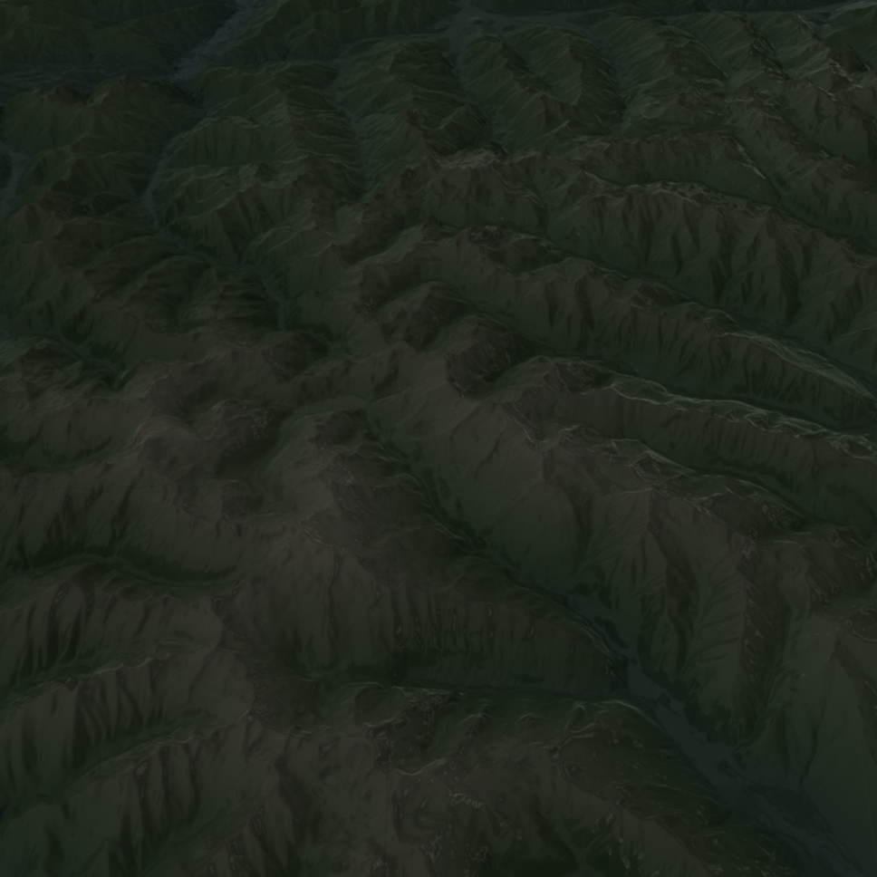

# Map3D

Tyler also offers to view tiles in 3D, and offers a simple Elevation and PointCloud provider.

````@example map3d
using Tyler, GLMakie
using Tyler: ElevationProvider

lat, lon = (47.087441, 13.377214)
delta = 0.3
ext = Rect2f(lon-delta/2, lat-delta/2, delta, delta)
m = Tyler.Map3D(ext; provider=ElevationProvider())
````

## Elevation with PlotConfig

With PlotConfig one can change the way tiles are plotted.
The it has a preprocess + postprocess function and allows to pass any plot attribute to the tile.
These attributes are global and will be passed to every tile plot.

````@example map3d
lat, lon = (47.087441, 13.377214)
delta = 0.3
ext = Rect2f(lon - delta / 2, lat - delta / 2, delta, delta)
cfg = Tyler.PlotConfig(
    preprocess=pc -> map(p -> p .* 2, pc),
    shading=FastShading, colorrange=(2000, 5000),
    colormap=:alpine
)
m = Tyler.Map3D(ext; provider=ElevationProvider(nothing), plot_config=cfg)
````

## PointClouds

The PointCloud provider downloads from [geotiles.citg.tudelft](https://geotiles.citg.tudelft.nl), which spans most of the netherlands.

````@example map3d
lat, lon = (52.40459835, 4.84763329)
delta = 0.03
ext = Rect2f(lon - delta / 2, lat - delta / 2, delta, delta)
provider = Tyler.GeoTilePointCloudProvider()
m = Tyler.Map3D(ext; provider=provider)
````


## Pointclouds with PlotConfig + Meshscatter

There is also a MeshScatter plot config, which can be used to switch the point cloud plotting from scatter to meshscatter.
This looks better, at a significant slow down.

````@example map3d
lat, lon = (52.40459835, 4.84763329)
delta = 0.008
ext = Rect2f(lon - delta / 2, lat - delta / 2, delta, delta)
provider = Tyler.GeoTilePointCloudProvider()
image = ElevationProvider(nothing)
cfg = Tyler.MeshScatterPlotconfig(; markersize=2)
m1 = Tyler.Map3D(ext; provider=provider, plot_config=cfg)
cfg = Tyler.PlotConfig(preprocess=pc -> map(p -> p .* 2, pc), shading=FastShading, colormap=:alpine)
m2 = Tyler.Map3D(m1; provider=image, plot_config=cfg)
m1
````


## Using RPRMakie

```julia
using RPRMakie, FileIO
function render_rpr(m, name, radiance=1000000)
    wait(m)
    ax = m.axis
    cam = ax.scene.camera_controls
    lightpos = Vec3f(cam.lookat[][1], cam.lookat[][2], cam.eyeposition[][3])
    lights = [
        EnvironmentLight(1.5, load(RPR.assetpath("studio026.exr"))),
        PointLight(lightpos, RGBf(radiance, radiance * 0.9, radiance * 0.9))
    ]
    empty!(ax.scene.lights)
    append!(ax.scene.lights, lights)
    save("$(name).png", ax.scene; plugin=RPR.Northstar, backend=RPRMakie, iterations=2000)
end
function plastic_material()
    return (type=:Uber, reflection_color=Vec4f(1),
        reflection_weight=Vec4f(1), reflection_roughness=Vec4f(0.1),
        reflection_anisotropy=Vec4f(0), reflection_anisotropy_rotation=Vec4f(0),
        reflection_metalness=Vec4f(0), reflection_ior=Vec4f(1.4), refraction_weight=Vec4f(0),
        coating_weight=Vec4f(0), sheen_weight=Vec4f(0), emission_weight=Vec3f(0),
        transparency=Vec4f(0), reflection_mode=UInt(RPR.RPR_UBER_MATERIAL_IOR_MODE_PBR),
        emission_mode=UInt(RPR.RPR_UBER_MATERIAL_EMISSION_MODE_SINGLESIDED),
        coating_mode=UInt(RPR.RPR_UBER_MATERIAL_IOR_MODE_PBR), sss_multiscatter=true,
        refraction_thin_surface=true)
end
```

### Elevation with RPRMakie

```julia
lat, lon = (47.087441, 13.377214)
delta = 0.5
ext = Rect2f(lon - delta / 2, lat - delta / 2, delta, delta)
cfg = Tyler.PlotConfig(
    preprocess=pc -> map(p -> p .* 2, pc),
    shading=FastShading,
    material=plastic_material(),
    colormap=:alpine
)
m = Tyler.Map3D(ext;
    provider=ElevationProvider(nothing),
    plot_config=cfg,
    max_plots=5
)
render_rpr(m, "alpine", 10000000)
```



### PointClouds with RPRMakie

```julia
lat, lon = (52.40459835229174, 4.84763329882317)
delta = 0.005
ext = Rect2f(lon - delta / 2, lat - delta / 2, delta, delta)
provider = Tyler.GeoTilePointCloudProvider()
mat = (type=:Microfacet, roughness=0.2, ior=1.390)
cfg = Tyler.MeshScatterPlotconfig(material=mat, markersize=4)
m = Tyler.Map3D(ext; provider=provider, plot_config=cfg, max_plots=3, size=(2000, 2000))
cfg = Tyler.PlotConfig(material=mat, colormap=:Blues)
m2 = Tyler.Map3D(m; provider=ElevationProvider(nothing), plot_config=cfg, max_plots=5)
render_rpr(m, "pointclouds")
cp(Tyler)
```


