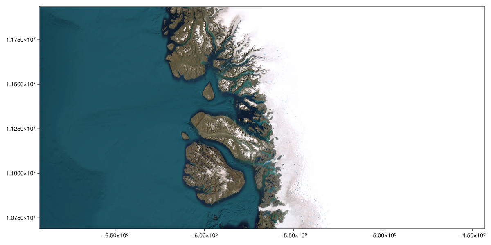

## Greenland ice loss example: animated & interactive {#Greenland-ice-loss-example:-animated-and-interactive}

```julia
using Tyler
using Tyler.TileProviders
using Tyler.Extents
using Dates
using HTTP
using Arrow
using DataFrames
using GLMakie
using GLMakie.Colors
GLMakie.activate!()
```


::: info

Ice loss from the Greenland Ice Sheet: 1972-2022.
- Contact person: Alex Gardner & Chad Greene
  

:::

Load ice loss data [courtesy of Chad Greene @ JPL]

```julia
url = "https://github.com/JuliaGeo/JuliaGeoData/blob/365a09596bfca59e0977c20c2c2f566c0b29dbaa/assets/data/iceloss_subset.arrow?raw=true";
resp = HTTP.get(url);
df = DataFrame(Arrow.Table(resp.body));
first(df, 5)
```

<div v-html="`&lt;div&gt;&lt;div style = &quot;float: left;&quot;&gt;&lt;span&gt;5×3 DataFrame&lt;/span&gt;&lt;/div&gt;&lt;div style = &quot;clear: both;&quot;&gt;&lt;/div&gt;&lt;/div&gt;&lt;div class = &quot;data-frame&quot; style = &quot;overflow-x: scroll;&quot;&gt;&lt;table class = &quot;data-frame&quot; style = &quot;margin-bottom: 6px;&quot;&gt;&lt;thead&gt;&lt;tr class = &quot;header&quot;&gt;&lt;th class = &quot;rowNumber&quot; style = &quot;font-weight: bold; text-align: right;&quot;&gt;Row&lt;/th&gt;&lt;th style = &quot;text-align: left;&quot;&gt;X&lt;/th&gt;&lt;th style = &quot;text-align: left;&quot;&gt;Y&lt;/th&gt;&lt;th style = &quot;text-align: left;&quot;&gt;Date&lt;/th&gt;&lt;/tr&gt;&lt;tr class = &quot;subheader headerLastRow&quot;&gt;&lt;th class = &quot;rowNumber&quot; style = &quot;font-weight: bold; text-align: right;&quot;&gt;&lt;/th&gt;&lt;th title = &quot;SubArray{Float64, 1, Arrow.Primitive{Float64, Vector{Float64}}, Tuple{UnitRange{Int64}}, true}&quot; style = &quot;text-align: left;&quot;&gt;SubArray…&lt;/th&gt;&lt;th title = &quot;SubArray{Float64, 1, Arrow.Primitive{Float64, Vector{Float64}}, Tuple{UnitRange{Int64}}, true}&quot; style = &quot;text-align: left;&quot;&gt;SubArray…&lt;/th&gt;&lt;th title = &quot;Dates.DateTime&quot; style = &quot;text-align: left;&quot;&gt;DateTime&lt;/th&gt;&lt;/tr&gt;&lt;/thead&gt;&lt;tbody&gt;&lt;tr&gt;&lt;td class = &quot;rowNumber&quot; style = &quot;font-weight: bold; text-align: right;&quot;&gt;1&lt;/td&gt;&lt;td style = &quot;text-align: left;&quot;&gt;[-5.86725e6, -5.86687e6, -5.86648e6, -5.86609e6, -5.86753e6, -5.75864e6, -5.7174e6, -5.71703e6, -5.71665e6, -5.71924e6  …  -5.6051e6, -5.60477e6, -5.60444e6, -5.60411e6, -5.60378e6, -5.60345e6, -5.60312e6, -5.60279e6, -5.60246e6, -5.60213e6]&lt;/td&gt;&lt;td style = &quot;text-align: left;&quot;&gt;[1.17525e7, 1.17526e7, 1.17526e7, 1.17527e7, 1.17517e7, 1.1661e7, 1.15656e7, 1.15656e7, 1.15657e7, 1.1565e7  …  1.07214e7, 1.07214e7, 1.07214e7, 1.07215e7, 1.07215e7, 1.07215e7, 1.07215e7, 1.07216e7, 1.07216e7, 1.07216e7]&lt;/td&gt;&lt;td style = &quot;text-align: left;&quot;&gt;1972-10-15T00:00:00&lt;/td&gt;&lt;/tr&gt;&lt;tr&gt;&lt;td class = &quot;rowNumber&quot; style = &quot;font-weight: bold; text-align: right;&quot;&gt;2&lt;/td&gt;&lt;td style = &quot;text-align: left;&quot;&gt;[-5.8672e6, -5.86681e6, -5.86643e6, -5.86748e6, -5.76523e6, -5.71736e6, -5.71699e6, -5.71661e6, -5.7192e6, -5.71882e6  …  -5.60639e6, -5.60606e6, -5.60573e6, -5.6054e6, -5.60507e6, -5.60408e6, -5.60375e6, -5.60342e6, -5.60309e6, -5.60276e6]&lt;/td&gt;&lt;td style = &quot;text-align: left;&quot;&gt;[1.17521e7, 1.17522e7, 1.17522e7, 1.17513e7, 1.16579e7, 1.15652e7, 1.15652e7, 1.15653e7, 1.15646e7, 1.15647e7  …  1.07209e7, 1.07209e7, 1.0721e7, 1.0721e7, 1.0721e7, 1.07211e7, 1.07212e7, 1.07212e7, 1.07212e7, 1.07212e7]&lt;/td&gt;&lt;td style = &quot;text-align: left;&quot;&gt;1972-11-15T00:00:00&lt;/td&gt;&lt;/tr&gt;&lt;tr&gt;&lt;td class = &quot;rowNumber&quot; style = &quot;font-weight: bold; text-align: right;&quot;&gt;3&lt;/td&gt;&lt;td style = &quot;text-align: left;&quot;&gt;[-5.86715e6, -5.71732e6, -5.71694e6, -5.71657e6, -5.71765e6, -5.72354e6, -5.72316e6, -5.71865e6, -5.72633e6, -5.72729e6  …  -5.56852e6, -5.5695e6, -5.5639e6, -5.56258e6, -5.56271e6, -5.60087e6, -5.60441e6, -5.60372e6, -5.60339e6, -5.60306e6]&lt;/td&gt;&lt;td style = &quot;text-align: left;&quot;&gt;[1.17517e7, 1.15648e7, 1.15649e7, 1.15649e7, 1.15644e7, 1.15626e7, 1.15627e7, 1.15632e7, 1.15604e7, 1.15588e7  …  1.08169e7, 1.08165e7, 1.08143e7, 1.08107e7, 1.08083e7, 1.07224e7, 1.07211e7, 1.07208e7, 1.07209e7, 1.07209e7]&lt;/td&gt;&lt;td style = &quot;text-align: left;&quot;&gt;1972-12-15T00:00:00&lt;/td&gt;&lt;/tr&gt;&lt;tr&gt;&lt;td class = &quot;rowNumber&quot; style = &quot;font-weight: bold; text-align: right;&quot;&gt;4&lt;/td&gt;&lt;td style = &quot;text-align: left;&quot;&gt;[-5.71728e6, -5.7169e6, -5.71653e6, -5.71761e6, -5.71941e6, -5.71903e6, -5.63901e6, -5.62706e6, -5.59818e6, -5.59062e6, -5.59024e6, -5.58989e6, -5.59155e6, -5.56301e6, -5.60474e6, -5.60405e6]&lt;/td&gt;&lt;td style = &quot;text-align: left;&quot;&gt;[1.15645e7, 1.15645e7, 1.15645e7, 1.1564e7, 1.15631e7, 1.15631e7, 1.12759e7, 1.12427e7, 1.10848e7, 1.10753e7, 1.1075e7, 1.1075e7, 1.09937e7, 1.0808e7, 1.07211e7, 1.07208e7]&lt;/td&gt;&lt;td style = &quot;text-align: left;&quot;&gt;1973-01-15T00:00:00&lt;/td&gt;&lt;/tr&gt;&lt;tr&gt;&lt;td class = &quot;rowNumber&quot; style = &quot;font-weight: bold; text-align: right;&quot;&gt;5&lt;/td&gt;&lt;td style = &quot;text-align: left;&quot;&gt;[-5.71724e6, -5.71686e6, -5.71795e6, -5.59853e6, -5.59027e6, -5.58992e6, -5.59152e6, -5.60438e6]&lt;/td&gt;&lt;td style = &quot;text-align: left;&quot;&gt;[1.15641e7, 1.15641e7, 1.15636e7, 1.10848e7, 1.10753e7, 1.10753e7, 1.09934e7, 1.07208e7]&lt;/td&gt;&lt;td style = &quot;text-align: left;&quot;&gt;1973-02-15T00:00:00&lt;/td&gt;&lt;/tr&gt;&lt;/tbody&gt;&lt;/table&gt;&lt;/div&gt;`"></div>

select map provider

```julia
provider = TileProviders.Esri(:WorldImagery);
```


```ansi
┌ Warning: Error while fetching tile on thread 1
│   exception =
│    RequestError: Operation timed out after 3106 milliseconds with 0 bytes received while requesting https://tile.opentopomap.org/10/511/340.png
│    Stacktrace:
│      [1] (::Downloads.var"#9#19"{IOBuffer, Base.DevNull, Nothing, Vector{Pair{String, String}}, Float64, Nothing, Bool, Nothing, Bool, Nothing, String, Bool, Bool})(easy::Downloads.Curl.Easy)
│        @ Downloads /opt/hostedtoolcache/julia/1.11.5/x64/share/julia/stdlib/v1.11/Downloads/src/Downloads.jl:452
│      [2] with_handle(f::Downloads.var"#9#19"{IOBuffer, Base.DevNull, Nothing, Vector{Pair{String, String}}, Float64, Nothing, Bool, Nothing, Bool, Nothing, String, Bool, Bool}, handle::Downloads.Curl.Easy)
│        @ Downloads.Curl /opt/hostedtoolcache/julia/1.11.5/x64/share/julia/stdlib/v1.11/Downloads/src/Curl/Curl.jl:105
│      [3] #8
│        @ /opt/hostedtoolcache/julia/1.11.5/x64/share/julia/stdlib/v1.11/Downloads/src/Downloads.jl:363 [inlined]
│      [4] arg_write(f::Downloads.var"#8#18"{Base.DevNull, Nothing, Vector{Pair{String, String}}, Float64, Nothing, Bool, Nothing, Bool, Nothing, String, Bool, Bool}, arg::IOBuffer)
│        @ ArgTools /opt/hostedtoolcache/julia/1.11.5/x64/share/julia/stdlib/v1.11/ArgTools/src/ArgTools.jl:134
│      [5] #7
│        @ /opt/hostedtoolcache/julia/1.11.5/x64/share/julia/stdlib/v1.11/Downloads/src/Downloads.jl:362 [inlined]
│      [6] arg_read
│        @ /opt/hostedtoolcache/julia/1.11.5/x64/share/julia/stdlib/v1.11/ArgTools/src/ArgTools.jl:76 [inlined]
│      [7] request(url::String; input::Nothing, output::IOBuffer, method::Nothing, headers::Vector{Pair{String, String}}, timeout::Float64, progress::Nothing, verbose::Bool, debug::Nothing, throw::Bool, downloader::Downloads.Downloader, interrupt::Nothing)
│        @ Downloads /opt/hostedtoolcache/julia/1.11.5/x64/share/julia/stdlib/v1.11/Downloads/src/Downloads.jl:361
│      [8] request
│        @ /opt/hostedtoolcache/julia/1.11.5/x64/share/julia/stdlib/v1.11/Downloads/src/Downloads.jl:328 [inlined]
│      [9] #3
│        @ /opt/hostedtoolcache/julia/1.11.5/x64/share/julia/stdlib/v1.11/Downloads/src/Downloads.jl:259 [inlined]
│     [10] arg_write(f::Downloads.var"#3#4"{Nothing, Vector{Pair{String, String}}, Float64, Nothing, Bool, Nothing, Downloads.Downloader, String}, arg::IOBuffer)
│        @ ArgTools /opt/hostedtoolcache/julia/1.11.5/x64/share/julia/stdlib/v1.11/ArgTools/src/ArgTools.jl:134
│     [11] #download#2
│        @ /opt/hostedtoolcache/julia/1.11.5/x64/share/julia/stdlib/v1.11/Downloads/src/Downloads.jl:258 [inlined]
│     [12] download
│        @ /opt/hostedtoolcache/julia/1.11.5/x64/share/julia/stdlib/v1.11/Downloads/src/Downloads.jl:247 [inlined]
│     [13] download_tile_data(dl::Tyler.ByteDownloader, provider::TileProviders.Provider, url::String)
│        @ Tyler ~/work/Tyler.jl/Tyler.jl/src/downloader.jl:19
│     [14] fetch_tile
│        @ ~/work/Tyler.jl/Tyler.jl/src/provider/shared.jl:10 [inlined]
│     [15] (::Tyler.var"#20#21"{Tyler.ByteDownloader, TileProviders.Provider, MapTiles.Tile})()
│        @ Tyler ~/work/Tyler.jl/Tyler.jl/src/tile-cache.jl:93
│     [16] get!(default::Tyler.var"#20#21"{Tyler.ByteDownloader, TileProviders.Provider, MapTiles.Tile}, lru::LRUCache.LRU{String, Union{Nothing, Matrix{ColorTypes.RGB{FixedPointNumbers.N0f8}}}}, key::String)
│        @ LRUCache ~/.julia/packages/LRUCache/ZH7qB/src/LRUCache.jl:169
│     [17] run_loop(dl::Tyler.ByteDownloader, tile_queue::Channel{MapTiles.Tile}, fetched_tiles::LRUCache.LRU{String, Union{Nothing, Matrix{ColorTypes.RGB{FixedPointNumbers.N0f8}}}}, provider::TileProviders.Provider, downloaded_tiles::Channel{Tuple{MapTiles.Tile, Union{Nothing, Matrix{ColorTypes.RGB{FixedPointNumbers.N0f8}}}}})
│        @ Tyler ~/work/Tyler.jl/Tyler.jl/src/tile-cache.jl:91
│     [18] (::Tyler.var"#8#11"{TileProviders.Provider, Channel{MapTiles.Tile}, Channel{Tuple{MapTiles.Tile, Union{Nothing, Matrix{ColorTypes.RGB{FixedPointNumbers.N0f8}}}}}, LRUCache.LRU{String, Union{Nothing, Matrix{ColorTypes.RGB{FixedPointNumbers.N0f8}}}}, Tyler.ByteDownloader})()
│        @ Tyler ~/work/Tyler.jl/Tyler.jl/src/tile-cache.jl:27
└ @ Tyler ~/work/Tyler.jl/Tyler.jl/src/tile-cache.jl:106
```


Greenland extent

```julia
extent = Extent(X = (-54., -48.), Y = (68.8, 72.5));
```


```ansi
Extent(X = (-54.0, -48.0), Y = (68.8, 72.5))
```


extract data

```julia
cnt = [length(foo) for foo in df.X];
X =  reduce(vcat,df.X);
Y =  reduce(vcat,df.Y);
Z = [repeat([i],c) for (i, c) = enumerate(cnt)];
Z = reduce(vcat,Z);
```


make a colormap

```julia
nc = length(Makie.to_colormap(:thermal));
n = nrow(df);
alpha = zeros(nc);
alpha[1:maximum([1,round(Int64,1*nc/n)])] = alpha[1:maximum([1,round(Int64,1*nc/n)])] .* (1.05^-1.5);
alpha[maximum([1,round(Int64,1*nc/n)])] = 1;
cmap = Colors.alphacolor.(Makie.to_colormap(:thermal), alpha);
cmap = Observable(cmap);
```


show map

```julia
fig = Figure(; size = (1200,600))
ax = Axis(fig[1,1])
m = Tyler.Map(extent; provider, figure=fig, axis=ax)
```

{width=1200px height=600px}

create initial scatter plot

```julia
scatter!(ax, X, Y; color = Z, colormap = cmap, colorrange = [0, n], markersize = 10);
m
```

{width=1200px height=600px}

add colorbar

```julia
a,b = extrema(df.Date);
a = year(a);
b = year(b);
Colorbar(fig[1,2]; colormap = cmap, colorrange = [a,b],
    height=Relative(0.5), width = 15)
# hide ticks, grid and lables
hidedecorations!(ax);
# hide frames
hidespines!(ax);
m
```

{width=1200px height=600px}

loop to create animation

```julia
for k = 1:15
    # reset apha
    alpha[:] = zeros(nc);
    cmap[] = Colors.alphacolor.(cmap[], alpha)
    for i in 2:1:n
        # modify alpha
        alpha[1:maximum([1,round(Int64,i*nc/n)])] = alpha[1:maximum([1,round(Int64,i*nc/n)])] .* (1.05^-1.5);
        alpha[maximum([1,round(Int64,i*nc/n)])] = 1;
        cmap[] = Colors.alphacolor.(cmap[], alpha);
        sleep(0.001);
    end
end
```

<video src="https://github.com/JuliaGeo/JuliaGeoData/raw/main/assets/videos/iceloss.mp4" controls="controls" autoplay="autoplay" ></video>

