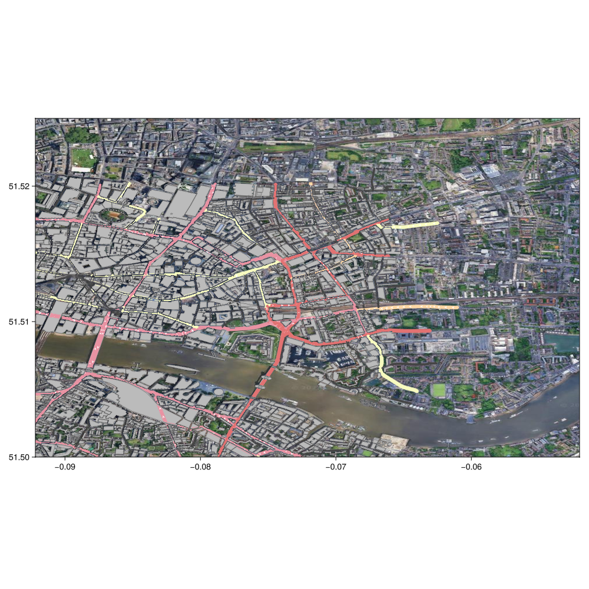

## OpenStreetMap data (OSM) {#OpenStreetMap-data-OSM}

In this example, we combine OpenStreetMap data, loading some roads and buildings and plotting them on top of a Tyler map.

```julia
using Tyler, Tyler.TileProviders
using GLMakie, OSMMakie, LightOSM

area = (
    minlat = 51.50, minlon = -0.0921, # bottom left corner
    maxlat = 51.52, maxlon = -0.0662 # top right corner
)

download_osm_network(:bbox; # rectangular area
    area..., # splat previously defined area boundaries
    network_type=:drive, # download motorways
    save_to_file_location="london_drive.json"
);

osm = graph_from_file("london_drive.json";
    graph_type=:light, # SimpleDiGraph
    weight_type=:distance
)

download_osm_buildings(:bbox;
    area...,
    metadata=true,
    download_format=:osm,
    save_to_file_location="london_buildings.osm"
);

# load as Buildings Dict
buildings = buildings_from_file("london_buildings.osm");
# Google + OSM
provider = TileProviders.Google(:satelite)
london = Rect2f(-0.0921, 51.5, 0.04, 0.025)
m = Tyler.Map(london; provider=provider, crs=Tyler.wgs84)
m.axis.aspect = map_aspect(area.minlat, area.maxlat)
p = osmplot!(m.axis, osm; buildings)
# DataInspector(m.axis) # this is broken/slow
m
```

{width=1000px height=1000px}
