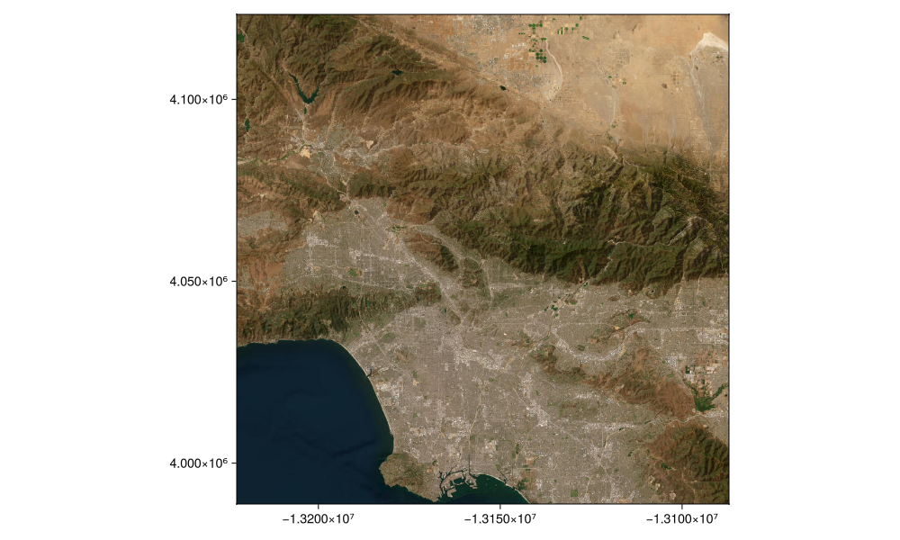
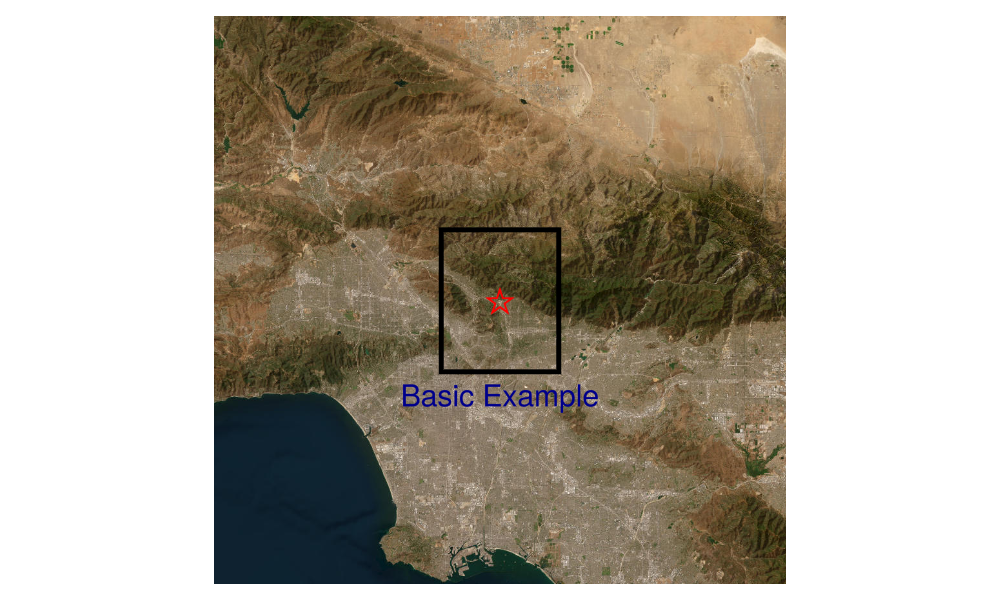

## Add points, polygons and text to a map {#Add-points,-polygons-and-text-to-a-map}

Load packages

```julia
using Tyler, GLMakie
using Tyler.TileProviders
using Tyler.MapTiles
using Tyler.Extents
```


select a map provider

```julia
provider = TileProviders.Esri(:WorldImagery)
```


```ansi
TileProviders.Provider("https://server.arcgisonline.com/ArcGIS/rest/services/{variant}/MapServer/tile/{z}/{y}/{x}", Dict{Symbol, Any}(:url => "https://server.arcgisonline.com/ArcGIS/rest/services/{variant}/MapServer/tile/{z}/{y}/{x}", :attribution => "Tiles (C) Esri -- Source: Esri, i-cubed, USDA, USGS, AEX, GeoEye, Getmapping, Aerogrid, IGN, IGP, UPR-EGP, and the GIS User Community", :variant => "World_Imagery", :name => "Esri.WorldImagery", :html_attribution => "Tiles &copy; Esri &mdash; Source: Esri, i-cubed, USDA, USGS, AEX, GeoEye, Getmapping, Aerogrid, IGN, IGP, UPR-EGP, and the GIS User Community"))
```


define a point to plot on the map

```julia
# point location to add to map
lat = 34.2013;
lon = -118.1714;
```


```ansi
-118.1714
```


convert to point in web_mercator

```julia
pts = Point2f(MapTiles.project((lon,lat), MapTiles.wgs84, MapTiles.web_mercator))
```


```ansi
2-element GeometryBasics.Point{2, Float32} with indices SOneTo(2):
 -1.315478f7
  4.0558638f6
```


set how much area to map in degrees and define an `Extent` for display in web_mercator

```julia
delta = 1
extent = Rect2f(lon - delta / 2, lat - delta / 2, delta, delta);
```


```ansi
GeometryBasics.HyperRectangle{2, Float32}(Float32[-118.6714, 33.7013], Float32[1.0, 1.0])
```


show map

```julia
m = Tyler.Map(extent; provider, size=(1000, 600))
```

{width=1000px height=600px}

now plot a point, polygon and text on the map

```julia
objscatter = scatter!(m.axis, pts; color = :red,
    marker = '⭐', markersize = 50)
# hide ticks, grid and lables
hidedecorations!(m.axis)
# hide frames
hidespines!(m.axis)
# Plot a plygon on the map
p1 = (lon-delta/8, lat-delta/8)
p2 = (lon-delta/8, lat+delta/8)
p3 = (lon+delta/8, lat+delta/8)
p4 = (lon+delta/8, lat-delta/8)

polyg = MapTiles.project.([p1, p2, p3, p4], Ref(MapTiles.wgs84), Ref(MapTiles.web_mercator))
polyg = Point2f.(polyg)
poly!(polyg; color = :transparent, strokecolor = :black, strokewidth = 5)

# Add text
pts2 = Point2f(MapTiles.project((lon,lat-delta/6), MapTiles.wgs84, MapTiles.web_mercator))
text!(pts2, text = "Basic Example"; fontsize = 30,
    color = :darkblue, align = (:center, :center)
    )
m
```

{width=1000px height=600px}
