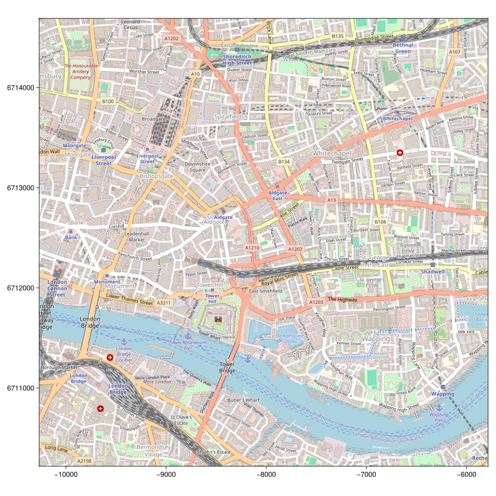
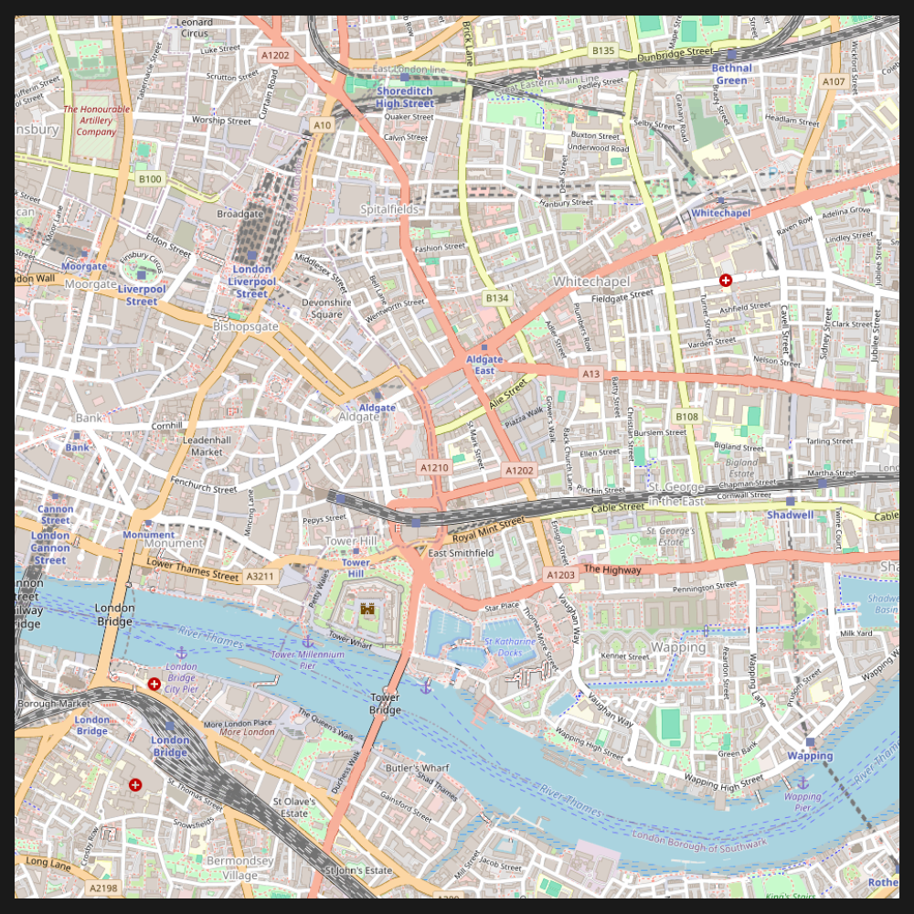
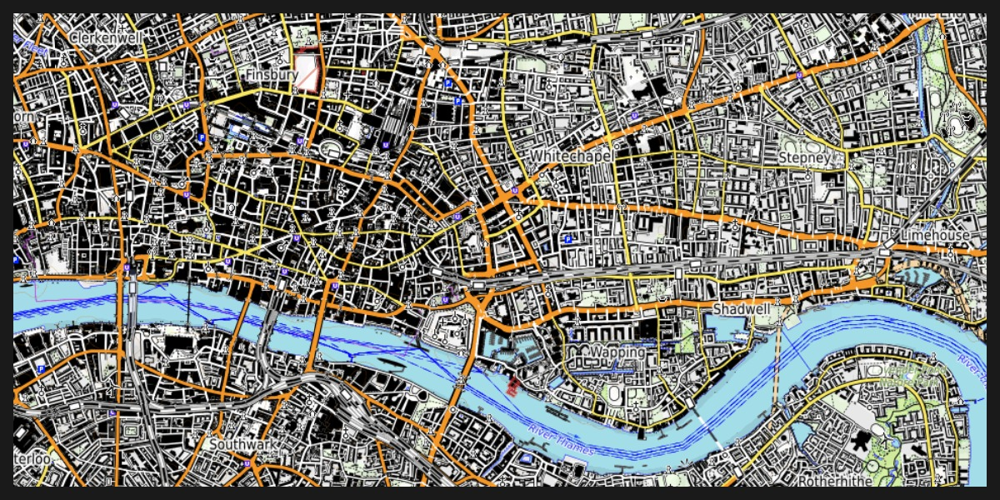

## Tyler.jl {#Tyler.jl}

A package for downloading map tiles on demand from different data source providers.
> 
> [!CAUTION] This package is currently in the initial phase of development. It needs support. Sponsorships are welcome!
> 


## Installation {#Installation}

In the Julia REPL type:

```julia
] add Tyler
```


The `]` character starts the Julia [package manager](https://docs.julialang.org/en/v1/stdlib/Pkg/). Hit backspace key to return to Julia prompt.

Or, explicitly use `Pkg`

```julia
using Pkg
Pkg.add(["Tyler.jl"])
```


## Demo: London {#Demo:-London}

```julia
using Tyler, GLMakie
m = Tyler.Map(Rect2f(-0.0921, 51.5, 0.04, 0.025))
```

{width=1000px height=1000px}

::: info

A `Rect2f` definition takes as input the origin, first two entries, and the width and hight, last two numbers.

:::

## Tile provider {#Tile-provider}

We can use a different tile provider as well as any style `theme` from Makie as follows:

```julia
using GLMakie, Tyler
using Tyler.TileProviders

provider = TileProviders.OpenStreetMap(:Mapnik)
london = Rect2f(-0.0921, 51.5, 0.04, 0.025)

with_theme(theme_dark()) do
    m = Tyler.Map(london; provider)
    hidedecorations!(m.axis)
    hidespines!(m.axis)
    m
end
```

{width=1000px height=1000px}

## Providers list {#Providers-list}

More providers are available. See the following list:

```julia
providers = TileProviders.list_providers()
```


```ansi
Dict{Function, Vector{Symbol}} with 40 entries:
  OneMapSG           => [:Default, :Night, :Original, :Grey, :LandLot]
  AzureMaps          => [:MicrosoftImagery, :MicrosoftBaseDarkGrey, :MicrosoftB…
  MapBox             => []
  OpenSnowMap        => [:pistes]
  JusticeMap         => [:income, :americanIndian, :asian, :black, :hispanic, :…
  OpenStreetMap      => [:Mapnik, :DE, :CH, :France, :HOT, :BZH]
  MapTiler           => [:Streets, :Basic, :Bright, :Pastel, :Positron, :Hybrid…
  NASAGIBSTimeseries => [:Agricultural_Lands_Croplands_2000, :Agricultural_Land…
  OpenFireMap        => []
  FreeMapSK          => []
  CartoDB            => [:Positron, :PositronNoLabels, :PositronOnlyLabels, :Da…
  NLS                => [:osgb63k1885, :osgb1888, :osgb10k1888, :osgb1919, :osg…
  OpenAIP            => []
  TopPlusOpen        => [:Color, :Grey]
  BaseMapDE          => [:Color, :Grey]
  OpenTopoMap        => []
  MapTilesAPI        => [:OSMEnglish, :OSMFrancais, :OSMEspagnol]
  nlmaps             => [:standaard, :pastel, :grijs, :water, :luchtfoto]
  OpenSeaMap         => []
  ⋮                  => ⋮
```


::: info

For some providers additional configuration steps are necessary, look at the `TileProviders.jl` [documentation](https://juliageo.org/TileProviders.jl/dev/) for more information.

:::

## Figure size &amp; aspect ratio {#Figure-size-and-aspect-ratio}

Although, the figure size can be controlled by passing additional arguments to `Map`, it&#39;s better to define a Figure first and then continue with a normal Makie&#39;s figure creation workflow, namely

```julia
using GLMakie, Tyler
using Tyler.TileProviders

provider = TileProviders.OpenTopoMap()
london = Rect2f(-0.0921, 51.5, 0.04, 0.025)

with_theme(theme_dark()) do
    fig = Figure(; size =(1200,600))
    ax = Axis(fig[1,1]) # aspect = DataAspect()
    m = Tyler.Map(london; provider, figure=fig, axis=ax)
    wait(m)
    hidedecorations!(ax)
    hidespines!(ax)
    fig
end
```



Next, we could add any other plot type on top of the `ax` axis defined above.
