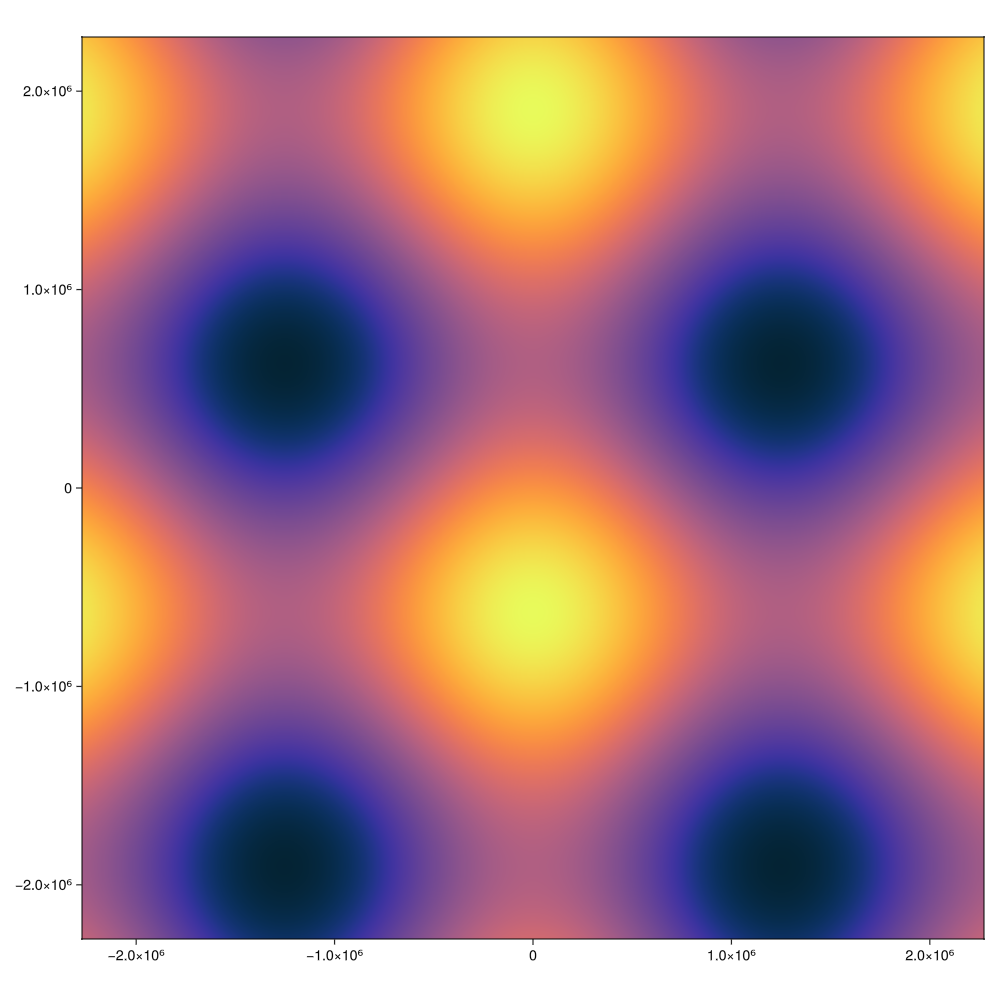

## Using Interpolation On The Fly {#Using-Interpolation-On-The-Fly}

::: info

Sine waves

:::

```julia
using Tyler, GLMakie
using Interpolations: interpolate, Gridded, Linear

f(lon,lat)=cosd(16*lon)+sind(16*lat)

f_in_0_1_range(lon,lat)=0.5+0.25*f(lon,lat)

nodes=(-180.0:180.0, -90.0:90.0)

array=[f(lon,lat) for lon in nodes[1], lat in nodes[2]]
array=(array.-minimum(array))./(maximum(array)-minimum(array))

itp = interpolate(nodes, array, Gridded(Linear()))
cols=Makie.to_colormap(:viridis)

col(i)=RGBAf(Makie.interpolated_getindex(cols,i))
fun(x,y) = col(itp(x,y))

options = Dict(:min_zoom => 1,:max_zoom => 19)

p1 = Tyler.Interpolator(f_in_0_1_range; options)
p2 = Tyler.Interpolator(fun; options)

b = Rect2f(-20.0, -20.0, 40.0, 40.0)
m = Tyler.Map(b, provider=p1)
```

{width=1000px height=1000px}

::: tip

Try `b = Rect2f(-180.0, -89.9, 360.0, 179.8)`

:::

::: info

`interpolated_getindex` requires input `i` to be in the `0-1` range.

:::
