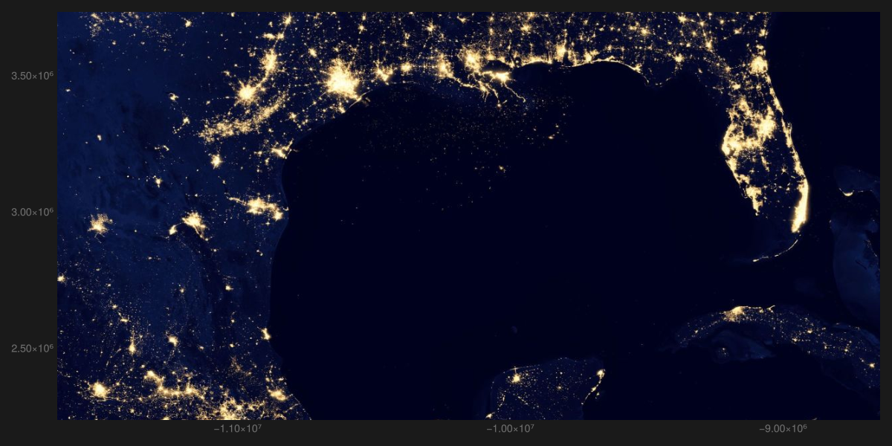
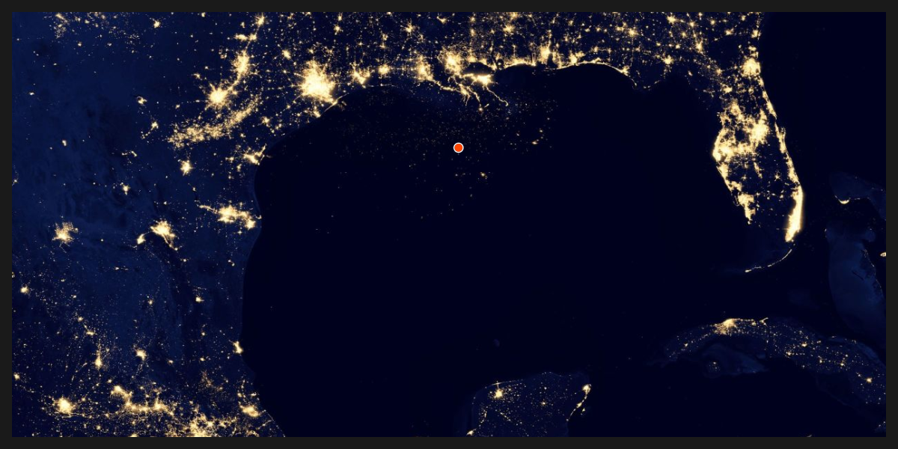

# Whale shark&#39;s trajectory {#Whale-shark's-trajectory}

The full stack of Makie&#39;s ecosystem works.

Load packages

```julia
using Tyler, GLMakie
using Tyler.TileProviders
using Tyler.MapTiles
using CSV, DataFrames
using DataStructures: CircularBuffer
using Downloads: download
```


Here, we will be using points that originally are in longitude and latitute, hence a function to transform those into the web_mercator projection is defined,

```julia
function to_web_mercator(lo,lat)
    return Point2f(MapTiles.project((lo,lat), MapTiles.wgs84, MapTiles.web_mercator))
end
```


and downloading and preparing the data is done next

```julia
url = "https://raw.githubusercontent.com/MakieOrg/Tyler.jl/master/docs/src/assets/data/whale_shark_128786.csv"
d = download(url)
whale = CSV.read(d, DataFrame)
lon = whale[!, :lon]
lat = whale[!, :lat]
steps = size(lon,1)
points = to_web_mercator.(lon,lat)

lomn, lomx = extrema(lon)
lamn, lamx = extrema(lat)
δlon = abs(lomn - lomx)
δlat = abs(lamn - lamx)
```


::: info

Whale shark movements in Gulf of Mexico.
- Contact person: Eric Hoffmayer
  

:::

Then a provider and the initial map are set

```julia
provider = TileProviders.NASAGIBS(:ViirsEarthAtNight2012)

set_theme!(theme_dark())
fig = Figure(; size = (1200, 600))
ax = Axis(fig[1,1])
m = Tyler.Map(Rect2f(Rect2f(lomn - δlon/2, lamn-δlat/2, 2δlon, 2δlat));
    provider, figure=fig, axis=ax)
```

{width=1200px height=600px}

## Initial point {#Initial-point}

```julia
nt = 30
trail = CircularBuffer{Point2f}(nt)
fill!(trail, points[1]) # add correct values to the circular buffer
trail = Observable(trail) # make it an observable
whale = Observable(points[1])

c = to_color(:orangered)
trailcolor = [RGBAf(c.r, c.g, c.b, (i/nt)^2.5) for i in 1:nt] # fading tail

objline = lines!(ax, trail; color = trailcolor, linewidth=3)
objscatter = scatter!(ax, whale; markersize = 15, color = :orangered,
    strokecolor=:white, strokewidth=1.5)
hidedecorations!(ax)
hidespines!(ax)
m
```

{width=1200px height=600px}

## Animated trajectory {#Animated-trajectory}

The animation is done by updating the Observable values

```julia
record(fig, "whale_shark_128786.mp4") do io
    for i in 2:steps
        push!(trail[], points[i])
        whale[] = points[i]
        trail[] = trail[]
        recordframe!(io)  # record a new frame
    end
end
set_theme!() # reset theme (default)
```

<video src="./whale_shark_128786.mp4" controls="controls" autoplay="autoplay"></video>

